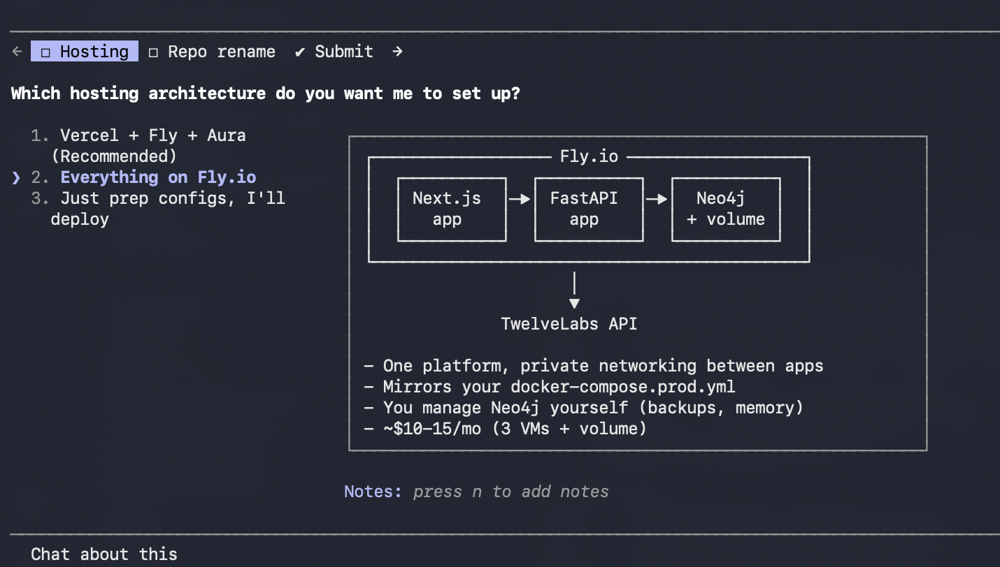

## ENH-1:
Done and verified end-to-end. Here's what changed:

The toggle

One line in .env switches everything:
LLM_PROVIDER=anthropic   # or "openai"

Changes

.env — set LLM_PROVIDER=anthropic, moved your sk-ant... key into ANTHROPIC_API_KEY (it was sitting in OPENAI_API_KEY), and restored your commented-out sk-svcacct... OpenAI key to OPENAI_API_KEY so the toggle works both ways. ANTHROPIC_MODEL=claude-sonnet-4-6 (kept your choice); ANTHROPIC_EXTRACTION_MODEL=claude-opus-4-8 (structured outputs need it).

backend/app/config.py — added llm_provider, anthropic_* settings, and llm_api_key/llm_model/llm_extraction_model properties that resolve per provider.

backend/app/llm_client.py (new) — the single branch point. Two functions the rest of the app calls, each with an OpenAI and an Anthropic path:
- generate_json() — rough-cut plans (Claude path uses the official anthropic SDK with adaptive thinking + effort)
- parse_structured() — Pydantic-validated extraction (client.messages.parse on Claude, responses.parse on OpenAI)

backend/app/routes.py — _openai_rough_cut_plan → _llm_rough_cut_plan, now calls the generic client; old inline OpenAI code left commented as requested.

backend/scripts/ingest.py — structure_with_openai → structure_with_llm, same treatment.

backend/app/agent.py — Strands brain now picks AnthropicModel or OpenAIResponsesModel by the toggle (added strands-agents[anthropic] via uv add).

Verified live (provider=anthropic)

- ✅ generate_json returned a valid plan dict (added a JSON-extraction guard — Claude sometimes wraps JSON in fences)
- ✅ parse_structured returned a validated Pydantic object via claude-opus-4-8
- ✅ Strands agent answered through AnthropicModel
- ✅ pytest — 2 passed
- ✅ Flipping to LLM_PROVIDER=openai resolves the OpenAI branch cleanly

One caveat: I didn't live-test the OpenAI side (your sk-svcacct key may or may not still be active) — flip the toggle and try it when you need it.

## ENH-2:
Done. Ingestion is now idempotent — re-running make seed (or whatever triggers scripts/ingest.py) won't create duplicates anymore.

How it works — two dedupe layers

1. TwelveLabs upload dedupe (twelvelabs_client.py → new find_video_by_filename()):
Before uploading, the ingest script queries the index with an exact filename filter. If the file's already indexed, it reuses the existing video_id instead of uploading again. Lookup failures fail open (worst case: one re-upload), so a flaky API call can't block ingestion.

2. Neo4j analysis dedupe (ingest.py → new _already_in_graph()):
If the video is also already in the graph with segments, the whole pipeline is skipped — no Pegasus analysis, no LLM extraction, no embeddings. This is the part that saves you money on repeat runs.

Escape hatch: make seed → uv run python scripts/ingest.py --force re-analyzes videos already in the graph (still without re-uploading to TwelveLabs).

Verified live against your index

- bbb_1080p_30fps_normal_85sec.mp4 (already in TL + Neo4j) → "already indexed in TwelveLabs — skipping upload" → "already in Neo4j graph too — nothing to do" — zero uploads, zero analysis
- A genuinely new file (Two_Sum...mp4) → lookup misses → would upload normally
- pytest: 2 passed

One thing you should know

While verifying, I found you already have duplicates from your earlier runs — each of the 4 Nike videos exists twice in both the TwelveLabs index and the Neo4j graph (plus bbb twice in Neo4j). The new code prevents new duplicates but doesn't remove the existing ones — and note the two copies got slightly different segmentations (e.g. "WHY DO IT" has 25 segments in one copy, 35 in the other), so search results may currently return the same moment twice.

Want me to clean those up? I'd delete the older copy of each duplicate from the TwelveLabs index and remove the corresponding Video + Segment nodes from Neo4j. It's destructive, so I won't do it without your go-ahead.

## ENH-3:
```The set up is currently running all local. How do I host both the backend, frontend and injestion to show a demo on a live running page? I also want to change the repo name to Framewise instead of Framewise-Hackersquad. I want to make this change to github as well to make this my own since there are more features now. I also want to have UI with multiple tabs on the left. one for Injestion of videos(instead of having them in the data folder and doing make install, I should be able to upload a video.) Then we have this current page as -is. and host the entire thing. Like the neo4j docker, backend, UI. Can I use Vercel? how about fly.io?```



✅ Pushed to github.com/anhsirksai/Framewise. Docker build is validating in the background.

Step 4: Your turn — two logins while the build runs:

1. Fly.io — type this in the prompt (the ! runs it in this session so I can see the result):
! flyctl auth login
1. (Sign up at fly.io first if you haven't — free, needs a card for verification but we're using the cheap tier.)
2. Aura — if you haven't yet: https://console.neo4j.io → Create instance → AuraDB Free → download credentials → paste me the URI + password.

Once I have both, I'll: create the Fly app → set secrets (Anthropic key, TwelveLabs key, Aura creds) → fly deploy → then walk you through the 3-click Vercel setup pointed at the deployed backend URL.


